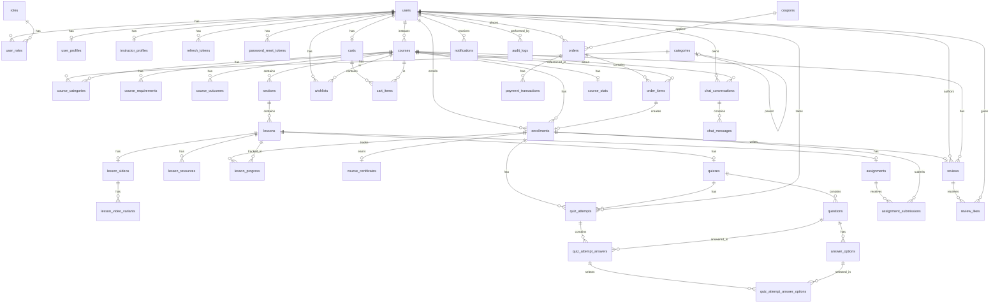

# Context: Entity Relationship

> Database entity relationships for Skillora. Based on `skill_database_schema.sql`.

## ER Diagram

## Key Relationships

| Relationship | Type | FK | Cascade |
|-------------|------|-----|---------| 
| User → Roles | Many-to-Many | user_roles join table | CASCADE |
| User → UserProfile | One-to-One | user_profiles.user_id | CASCADE |
| User → InstructorProfile | One-to-One | instructor_profiles.user_id | CASCADE |
| User → Courses | One-to-Many | courses.instructor_id | RESTRICT |
| Course → Categories | Many-to-Many | course_categories join table | CASCADE |
| Category → Parent | Self-referencing | categories.parent_id | SET NULL |
| Course → Requirements | One-to-Many | course_requirements.course_id | CASCADE |
| Course → Outcomes | One-to-Many | course_outcomes.course_id | CASCADE |
| Course → Sections | One-to-Many | sections.course_id | CASCADE |
| Section → Lessons | One-to-Many | lessons.section_id | CASCADE |
| Lesson → LessonVideo | One-to-One | lesson_videos.lesson_id | CASCADE |
| LessonVideo → Variants | One-to-Many | lesson_video_variants.lesson_video_id | CASCADE |
| Lesson → Resources | One-to-Many | lesson_resources.lesson_id | CASCADE |
| User + Course → Wishlist | Many-to-Many | wishlists (composite PK) | CASCADE |
| User → Cart | One-to-One | carts.user_id | CASCADE |
| Cart → CartItems | One-to-Many | cart_items.cart_id | CASCADE |
| User → Orders | One-to-Many | orders.user_id | RESTRICT |
| Order → Coupon | Many-to-One | orders.coupon_id | SET NULL |
| Order → OrderItems | One-to-Many | order_items.order_id | CASCADE |
| Order → PaymentTransactions | One-to-Many | payment_transactions.order_id | CASCADE |
| User + Course → Enrollment | Many-to-Many (with attrs) | UNIQUE(user_id, course_id) | RESTRICT |
| OrderItem → Enrollment | One-to-One (optional) | enrollments.order_item_id | SET NULL |
| Enrollment → LessonProgress | One-to-Many | UNIQUE(enrollment_id, lesson_id) | CASCADE |
| Enrollment → Certificate | One-to-One | UNIQUE(enrollment_id) | CASCADE |
| Lesson → Quiz | One-to-One | UNIQUE(lesson_id) | CASCADE |
| Quiz → Questions | One-to-Many | CASCADE |
| Question → AnswerOptions | One-to-Many | CASCADE |
| Enrollment + Quiz → QuizAttempt | UNIQUE(enrollment_id, quiz_id, attempt_no) | CASCADE |
| QuizAttempt → Answers | One-to-Many | CASCADE |
| Answer → SelectedOptions | Many-to-Many | CASCADE / RESTRICT |
| Lesson → Assignment | One-to-One | UNIQUE(lesson_id) | CASCADE |
| Assignment + Enrollment → Submission | UNIQUE(assignment_id, enrollment_id) | CASCADE |
| Enrollment → Review | One-to-One | UNIQUE(enrollment_id) | CASCADE |
| Review → ReviewLikes | Composite key (user_id, review_id) | CASCADE |
| Course → CourseStats | One-to-One | UNIQUE(course_id) | CASCADE |
| User → ChatConversations | One-to-Many | CASCADE |
| Conversation → Messages | One-to-Many | CASCADE |
| User → Notifications | One-to-Many | CASCADE |
| User → AuditLogs | One-to-Many (optional) | SET NULL |

## DB Views

| View | Purpose |
|------|---------|
| `v_course_detail` | Course detail with instructor info + aggregated stats |
| `v_enrollment_progress` | Enrollment with calculated lesson progress percentage |
| `v_student_courses` | Student's enrolled courses with instructor name |
